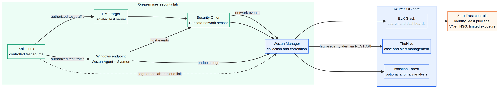

# Mini-SOC architecture

This document summarizes the architecture described in the ENET’com 2025–2026 Projet de Fin d’Année report. The public version uses logical names only. It intentionally excludes private IP addresses, Azure subscription information, tenant identifiers, resource-group names, credentials, and screenshots containing infrastructure details.

## Architecture overview

The project combines an **Azure-hosted SOC core** with an **on-premises security laboratory**. The cloud side centralizes collection, correlation, dashboards, and incident management. The local side provides isolated targets and controlled traffic-generation scenarios.

The architecture is organized around three logical security areas:

| Area | Role | Main elements |
|---|---|---|
| Management | Central security services | Wazuh Manager, ELK Stack, TheHive, Azure networking |
| Targets | Monitored systems | Windows endpoint with Wazuh Agent and Sysmon, isolated DMZ target |
| Attacker | Authorized validation source | Kali Linux in the local laboratory |

## Event flow

1. The Windows endpoint generates operating-system and Sysmon telemetry.
2. The network sensor observes authorized laboratory traffic through Suricata and Security Onion.
3. Wazuh receives endpoint and network events for collection, analysis, and correlation.
4. ELK components provide centralized search and visualization of security events.
5. An optional Isolation Forest component analyzes structured network events for behavioral anomalies beyond signature-based detection.
6. High-severity Wazuh alerts are transmitted through a REST API integration to TheHive.
7. TheHive presents the alert to the analyst for investigation and case management.

## Segmentation and access controls

The report describes Azure Virtual Network and Network Security Group controls with a restrictive default policy and only the service flows required for the laboratory. The public documentation does not reproduce the original inbound-rule table because the report contains environment-specific details.

The documented service categories are:

- Wazuh agent-to-manager communication.
- HTTPS access to security dashboards.
- API communication for TheHive alert ingestion.
- Administrative access restricted to authorized paths.

The design also minimizes public exposure and favors private internal communication for administration and log collection.

## Components and responsibilities

### Wazuh and Sysmon

Wazuh Agents collect endpoint telemetry. Sysmon enriches Windows visibility with process creation, network-connection, and file-activity events. The Wazuh Manager analyzes and correlates the incoming events.

### Security Onion and Suricata

Security Onion provides the local network-monitoring environment. Suricata acts as a network intrusion-detection component and produces structured events for subsequent analysis and correlation.

### ELK Stack

The ELK components provide centralized storage, search, and visualization of security events. They support analyst visibility into the events collected by the monitoring pipeline.

### TheHive

TheHive receives selected alerts through API integration. It organizes incidents, preserves alert context, and provides a case-management workflow for investigation.

### Isolation Forest

The report describes an optional Isolation Forest experiment for behavioral anomaly detection. It analyzes structured network events from the Suricata output and complements, rather than replaces, signature-based detection.

## Design constraints

The implementation was performed under Azure resource constraints, including virtual CPU and memory quotas. This influenced the separation of services across virtual machines and required careful management of dependencies and software compatibility.

## Public-release boundary

This diagram is a portfolio-level representation. It is not an operational network map. Do not add the original screenshots or configuration exports without removing private IP addresses, resource names, account identifiers, tokens, usernames, and other environment-specific details.

## Source

The content is derived from the authors’ ENET’com Projet de Fin d’Année report, *Présentation et mise en œuvre d’un Mini-SOC Hybride basé sur Azure et le modèle Zero Trust*, academic year 2025–2026.
